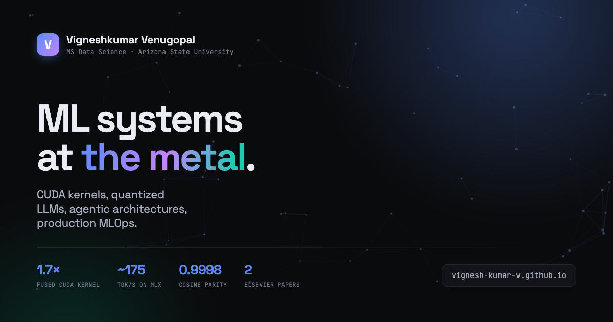

<div align="center">



# vignesh-kumar-v.github.io

**Personal portfolio of Vigneshkumar Venugopal** — ML systems engineer
MS Data Science @ Arizona State University

[**→ View the live site**](https://vignesh-kumar-v.github.io)

</div>

---

## About

A hand-written static site. No framework, no bundler, no dependencies, no build step — three
files do the work, and GitHub Pages serves them as-is. It ships in about 700 KB total, most of
which is the résumé PDF and the social card.

The content covers ten open-source projects, a research internship, two peer-reviewed Elsevier
publications, and the toolkit behind them.

## Features

| | |
|---|---|
| **Neural canvas** | Nodes drift across the hero, link within a radius, and lean toward the cursor. Colours are driven by CSS custom properties, so it follows the active theme. Skipped entirely under `prefers-reduced-motion`. |
| **Command palette** | <kbd>⌘</kbd><kbd>K</kbd> / <kbd>Ctrl</kbd><kbd>K</kbd> opens fuzzy search over every section, project, paper and link. Full keyboard control — <kbd>↑</kbd> <kbd>↓</kbd> <kbd>⏎</kbd> <kbd>Esc</kbd>. |
| **Filterable work grid** | Ten projects tagged Systems / LLM / Agentic / MLOps / Vision, filtered client-side with the reveal transition replayed on each change. |
| **Dual theme** | Molten Amber in dark and light. Follows the OS by default; a manual override persists in `localStorage`. |
| **Progressive enhancement** | All content is in the HTML. With JavaScript disabled you lose the canvas, palette and filters — the portfolio itself still reads fine. |
| **Accessibility** | Skip link, visible focus rings, ARIA states on the filter tabs, semantic landmarks, and a full `prefers-reduced-motion` path. |
| **SEO & sharing** | Open Graph + Twitter card, canonical URL, `sitemap.xml`, `robots.txt`, and a themed `404.html`. |

## Structure

```
index.html                  all content — semantic and crawlable
404.html                    themed not-found page
assets/
  css/style.css             design tokens, layout, responsive + print rules
  js/main.js                canvas, palette, filters, theme, scroll behaviour
  img/og.png                1200×630 social card
  img/og-source.html        source the card is rendered from
  Vigneshkumar-…-Resume.pdf résumé, linked from the hero and contact section
robots.txt  sitemap.xml  .nojekyll
```

## Design

The palette is **Molten Amber** — a warm near-black base with amber-to-ember accents, chosen to
echo the subject matter: thermal profiling, silicon, GPU kernels.

Everything is driven by custom properties on `:root`, with `[data-theme="light"]` overriding the
same names. To reskin the entire site, change those two blocks and nothing else:

```css
:root{
  --bg:#0b0a09;  --surface:#16130f;  --text:#f2ede6;
  --accent:#f5a524;      /* amber  */
  --accent-2:#ff6b35;    /* ember  */
  --accent-3:#e8c07d;    /* sand   */
  --canvas-node-rgb:255,190,110;   /* hero canvas follows automatically */
  --canvas-link-rgb:245,165,36;
}
```

Type is **Space Grotesk** for display, **Inter** for body, **JetBrains Mono** for metrics and
labels — the only external requests the site makes.

## Local development

```bash
git clone https://github.com/vignesh-kumar-v/vignesh-kumar-v.github.io.git
cd vignesh-kumar-v.github.io
python3 -m http.server 8000
```

Then open <http://localhost:8000>. There is nothing to install and nothing to compile — edit a
file and refresh.

## Maintenance

**Adding a project.** Copy an `<article class="proj">` block in `index.html`, set its `data-tags`,
and bump the count in the matching `.filter` button. Add a matching entry to `COMMANDS` in
`assets/js/main.js` so it appears in the palette. Use `class="proj proj--wide"` to make a card span
two columns.

**Updating the résumé.** Replace `assets/Vigneshkumar-Venugopal-Resume.pdf` in place — the filename
is stable, so no HTML changes are needed.

**Regenerating the social card.** Edit `assets/img/og-source.html`, then:

```bash
"/Applications/Google Chrome.app/Contents/MacOS/Google Chrome" --headless \
  --window-size=1200,630 --hide-scrollbars --virtual-time-budget=6000 \
  --screenshot="$PWD/assets/img/og.png" "file://$PWD/assets/img/og-source.html"
```

Social platforms cache these hard. After changing it, re-scrape via the
[LinkedIn Post Inspector](https://www.linkedin.com/post-inspector/) and the
[Facebook Sharing Debugger](https://developers.facebook.com/tools/debug/).

**Custom domain.** Add a `CNAME` file containing the domain, then point a DNS `CNAME` record at
`vignesh-kumar-v.github.io`.

## Analytics

[Cloudflare Web Analytics](https://developers.cloudflare.com/web-analytics/) — cookieless, no
consent banner required, and it does not follow visitors across sites. The site token lives in
`assets/js/analytics.js` and nowhere else; while that token is empty the file makes no requests
at all.

It reports visit counts, referrers, countries, page paths, and device types. It does **not**
report visitor identity — no analytics tool does.

### Tracked share links

Cloudflare deliberately drops query strings, so `?ref=` tags are invisible to it. Tagged links are
therefore real paths that register in *Top Pages* and then forward to the portfolio:

```bash
python3 tools/newlink.py nvidia-recruiter --note "Priya, ML infra role"
#   https://vignesh-kumar-v.github.io/r/nvidia-recruiter/

python3 tools/newlink.py --list        # every link created so far
```

Commit and push for a link to go live. Send a distinct one to each application or recruiter and
the dashboard shows which was opened and when — which is as close to "who viewed my portfolio"
as it is possible to get honestly, because you control who receives each link.

Link pages are `noindex` and canonical to `/`, so they never compete with the portfolio in search.

## Deployment

Pushing to `main` deploys. GitHub Pages serves the repository root, and `.nojekyll` tells it to
skip Jekyll processing.

## Contact

- **Email** — [vvenug15@asu.edu](mailto:vvenug15@asu.edu)
- **LinkedIn** — [in/vignesh5756](https://www.linkedin.com/in/vignesh5756)
- **GitHub** — [@vignesh-kumar-v](https://github.com/vignesh-kumar-v)

---

<div align="center">
<sub>Code MIT licensed · Written content and résumé © Vigneshkumar Venugopal</sub>
</div>
